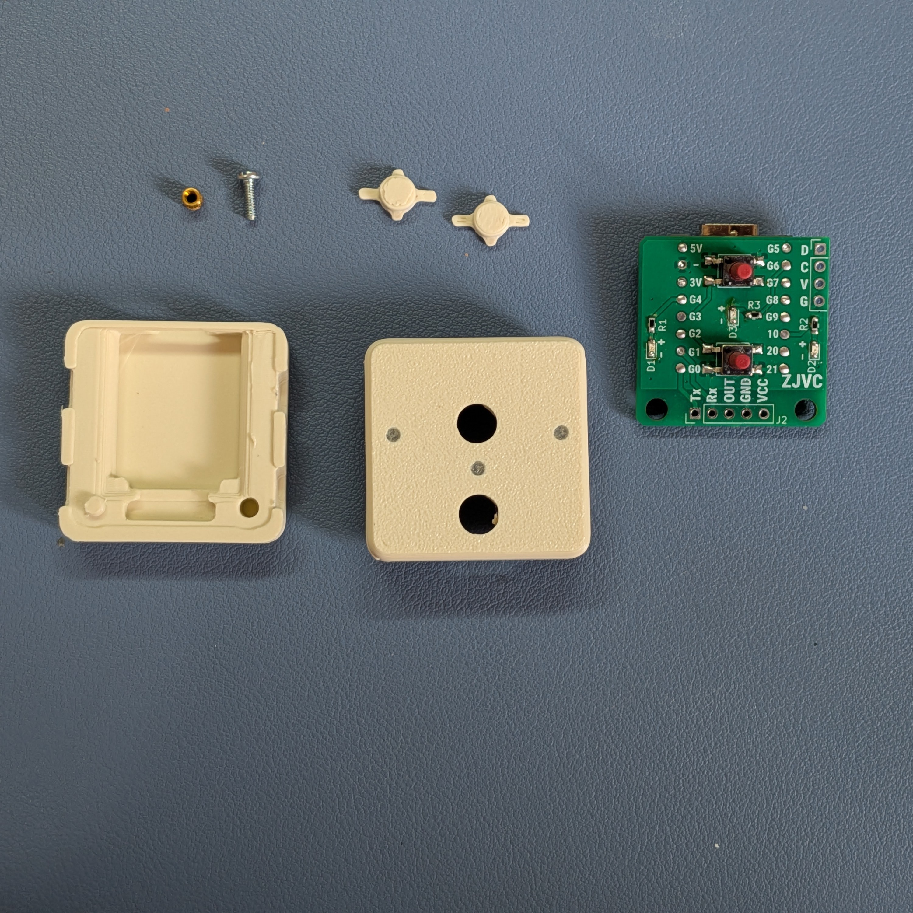
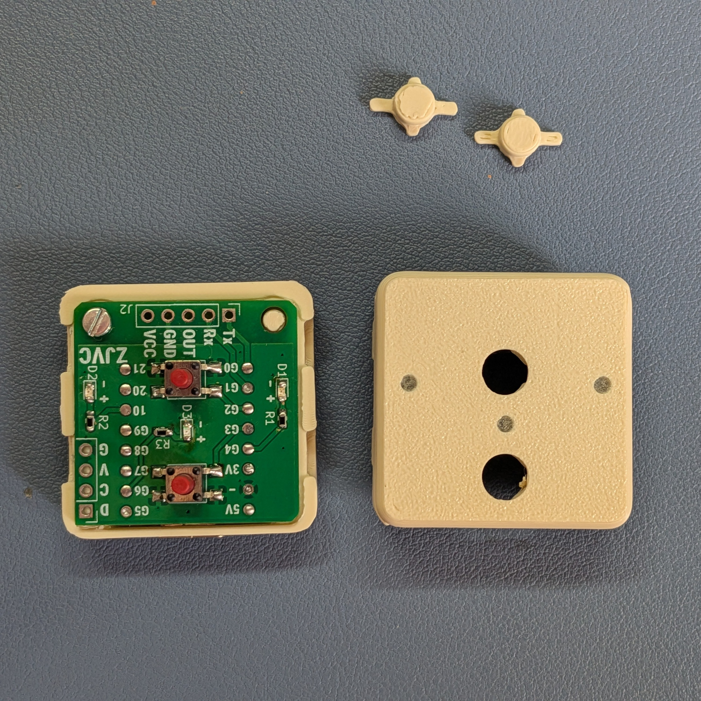
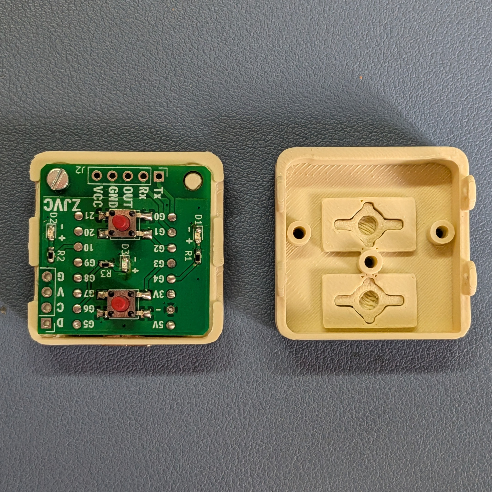
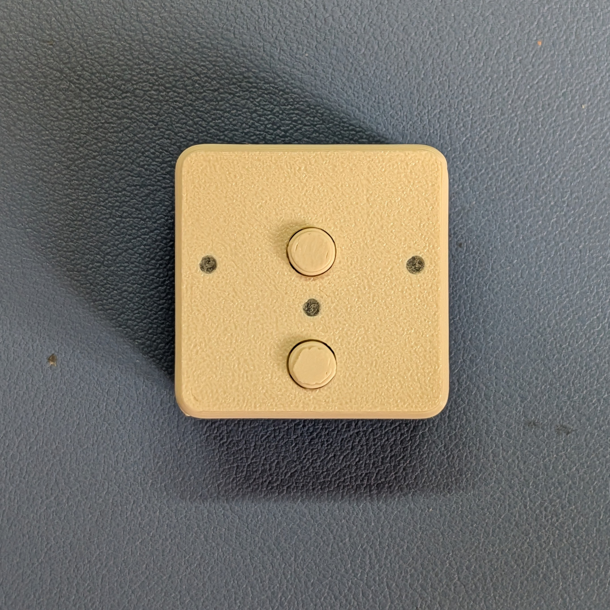

# Scoopy assembly

Assembly is the same for **Scoopy** and **Scoopy Compact**. The Presence version simply has the LD2410C fitted to the PCBA.

## What you need

- 1 × M2 brass heat-set insert
- 1 × M2 × 6 mm screw
  - For Scoopy Presence, use a **nylon screw** where possible. A metal screw may affect the LD2410C radar.
- 1 × Scoopy PCBA
- 1 × Scoopy base
- 1 × Scoopy lid
- 2 × Scoopy buttons

## 1. Fit the brass insert

Heat-set the M2 brass insert into the hole in the Scoopy base. Make sure it sits straight and allow it to cool fully before continuing.

## 2. Fit the PCBA

Slide the USB-C connector into the opening in the base, then lower the PCBA into position.

Secure the PCBA by threading the M2 × 6 mm screw into the brass insert.

> **Scoopy Presence:** use a nylon screw where possible. A metal screw close to the LD2410C may affect the radar.

## 3. Fit the buttons

Place both Scoopy buttons into the lid in their openings.

## 4. Close Scoopy

Push the base into the lid until it clips into place.

Check the orientation before pushing the two halves together: the lid's three light pipes must line up with the three LEDs on the PCBA.

## 5. Done

That's it — Scoopy is assembled.

## Set up Scoopy

Now you've built your Scoopy, head to the [Scoopy setup guide](https://nicehatthanks.com/setup/) to get it connected and running.
